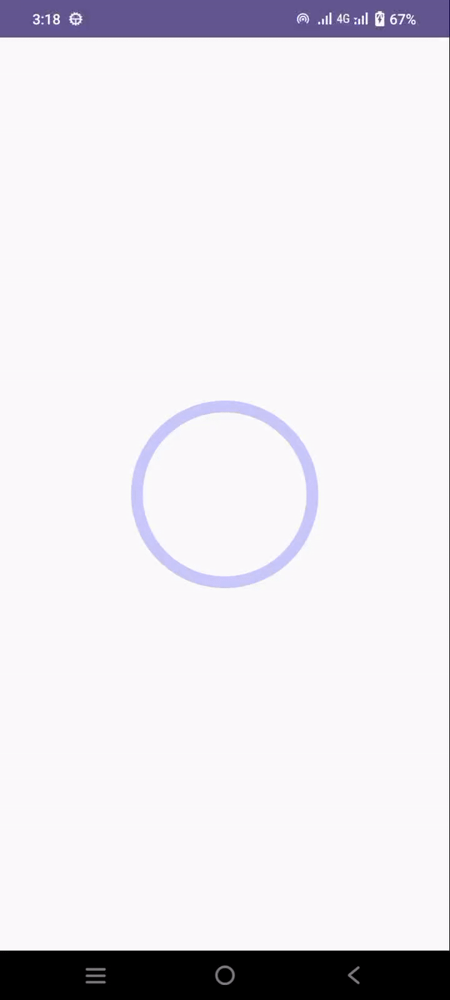
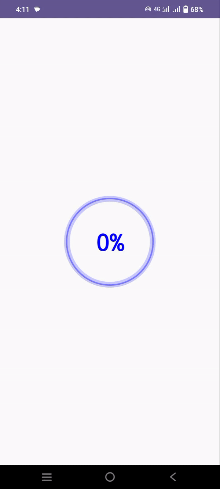
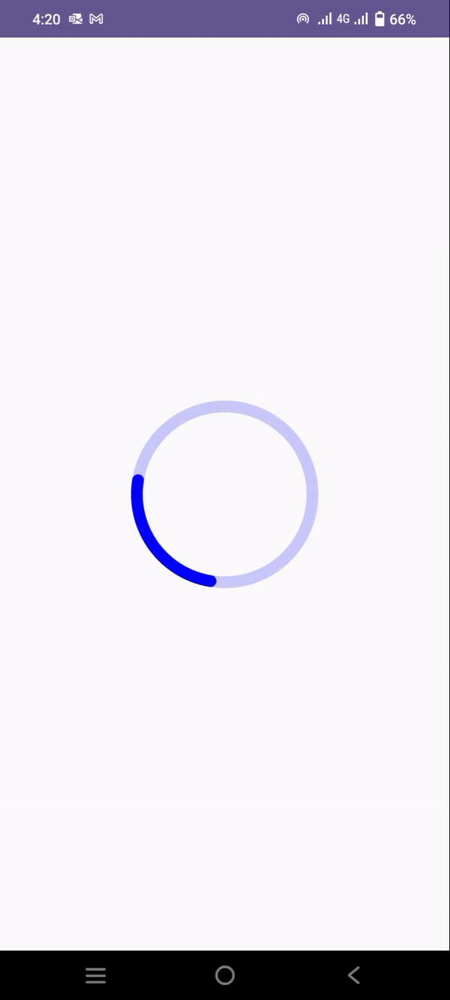

# CircularProgress JetpackCompose

[](https://jitpack.io/#tarifchakder/CircularProgress_JetpackCompose)

An android library to easily add circular progress bar into your [Jetpack Compose](https://developer.android.com/jetpack/compose) apps.

## Have a Look
&emsp;&emsp;

## Download
Add JitPack repository to your root `build.gradle` file
```
allprojects {
    repositories {
        maven { url 'https://jitpack.io' }
    }
}
```
Add the dependency to your app `build.gradle` file
```
dependencies {
    implementation 'com.github.tarifchakder:CircularProgress_JetpackCompose:1.0'
}
```

## Usage
Simple Circular ProgressBar
```kotlin
@Composable
fun simpleCircularProgress() {
    SimpleCircularProgress(
        radius = 80.dp,
        progress = progress.value,
        maxProgress = 100F,
        indicatorColor = Color.Blue,
        indicatorWidth = 10.dp,
        trackColor = Color.Blue.copy(0.2f),
        trackWidth = 10.dp,
        cornerRadius = true,
        startAngle = 0f,
        durationInMilliSecond = 2000
    )
}
```
Animated Determinate Progressbar
```Kotlin
@Composable
fun determinateProgressSample() {
    DeterminateProgress(
        modifier = Modifier,
        radius = 80.dp,
        indicatorColor = Color.Blue,
        trackColor = Color.Blue.copy(0.2f),
        indicatorStrokeWidth = 10.dp,
        trackStrokeWidth = 10.dp,
        progress = 90f,
        rotate = Rotate.RIGHT,
        roundedBorder = true,
        durationInMilliSecond = 10000,
        startDelay = 3000,
        waveAnimation = true
    )
}
```
Indeterminate ProgressBar
```Kotlin
@Composable
fun infiniteProgressSample() {
    IndeterminateProgress(
        modifier = Modifier,
        radius = 80.dp,
        indicatorColor = Color.Blue,
        trackColor = Color.Blue.copy(0.2f),
        indicatorStrokeWidth = 10.dp,
        trackStrokeWidth = 10.dp,
        rotate = Rotate.RIGHT,
        roundedBorder = true,
        durationInMilliSecond = 1400
    )
}
```
## Developed By

**Tarif Chakder**
### License
    Copyright (c) 2023 Tarif Chakder

    Licensed under the Apache License, Version 2.0 (the "License");
    you may not use this file except in compliance with the License.
    You may obtain a copy of the License at

       http://www.apache.org/licenses/LICENSE-2.0

    Unless required by applicable law or agreed to in writing, software
    distributed under the License is distributed on an "AS IS" BASIS,
    WITHOUT WARRANTIES OR CONDITIONS OF ANY KIND, either express or implied.
    See the License for the specific language governing permissions and
    limitations under the License.
